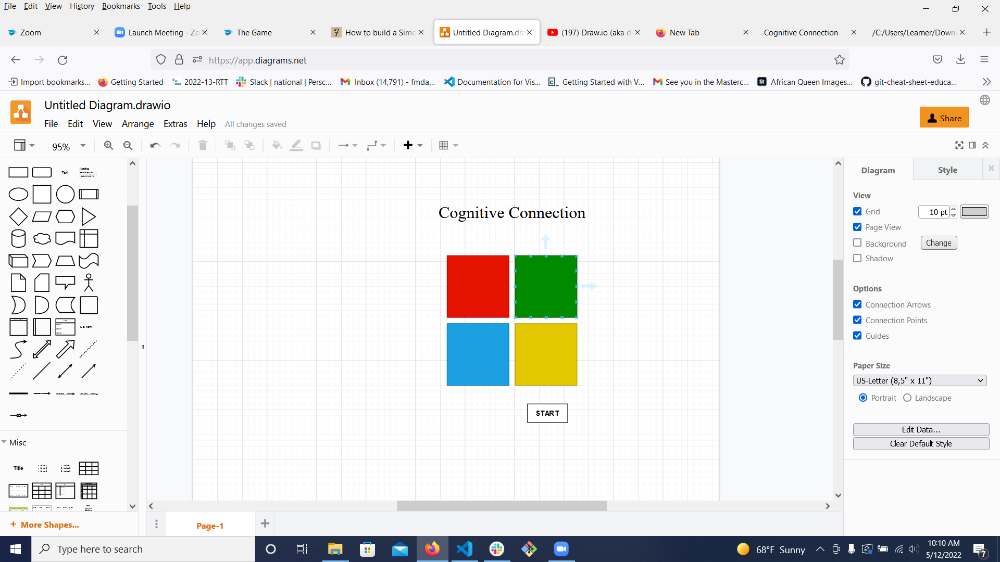

# Cognitive Connection

## Description

Cognitive Connection:
 A game of cognitive connections

 How to Play:

1.  Game play between computer and one person.
2. Player wins when last sequence is completed with no errors in sequence- player will receive a message of congratulations.
3. Player loses if they do not complete sequence will receive a message.
4. Game will reset for each level until player wins or misses a sequence.
5.  Player will play multiple rounds until the final level is reached. 

Stetch Goals:

1.  Game is reset for each play.  And to start a new game only needs to press start.
2.  Added CSS for personal style.
3.  Mobile design for small screen at 550px max width.

### Wireframe

### Resources 
https://freshman.tech/simon-game/

### Git Hub link
https://github.com/fmdavis1/Cognitive-Association

