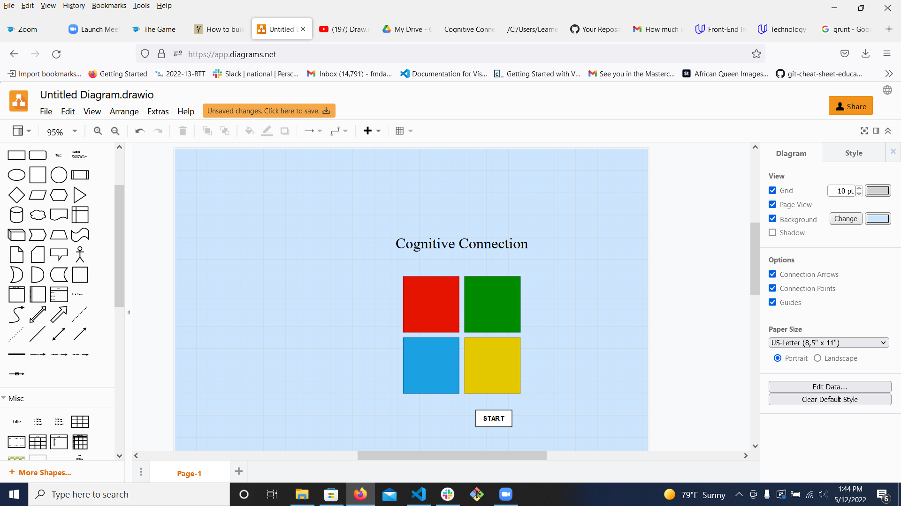

# Cognitive Connection

## Description

Cognitive Connection:
 A game of cognitive associations

 How to Play:

1.  Game play between computer and one person.
2. Player wins when last sequence is completed with no errors in sequence- player will receive a message of    
   congratulations.
3. Player loses if they do not complete sequence  and will receive a message and game will reset.
4. Game will reset for each level/round until player wins or misses a tile in the sequence.
5.  Player will play multiple rounds until the final level is reached. If player successfully completes final round they will receive message of Congrats and game will reset.

Stetch Goals:

1.  Game is reset for each play.  And to start a new game only needs to press start.
2.  Added CSS for personal style.
3.  Mobile design for small screen at 550px max width.

### Wireframe

Technologies:  HTML:
               CSS:  To style tiles and to hide and reveal text.
               Javascript:
                 Use of setTimeout function to provide delay between key taps and rounds.
                 Used ES6 spread operator on array to add values from one array to new array.
                 Used ES6 destructuring on object  to make use of tile color.

### Resources 
https://freshman.tech/simon-game/

### Git Hub link
https://fmdavis1.github.io/Cognitive-Association/

